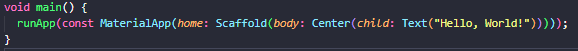
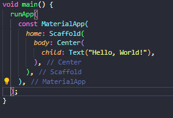

# Dart Basics

Dart is a programming language developed by Google and designed by Lars Bak and Kasper Lund. It's main purpose is web and mobile apps applications. It isn't restricted to that, it can also be used to program server and desktop applications.

Dart is an object-oriented, class-based, garbage-collected language with C-style syntax. It can compile to machine code, JavaScript, or WebAssembly. It supports interfaces, mixins, abstract classes, reified generics and type inference.

-[From Dart to Machine Code](#from-dart-to-machine-code)

-[Dart Functions](#dart-functions)

-[Importing features](#importing-features-from-packages)

-[Widgets](#widgets)

-[Const and Final](#const-and-final)

-[Trailing Comma](#trailing-comma)

-[Understanding Types](#understanding-types)

-[Formatting](#formatting)

-[Operators](#operators)

-[Enum](#enum)

## From Dart to Machine Code

Dart code isn't natively compiled and interpreted by iOS, Android, Web, etc. Instead, dart *parses the code from top to bottom when running a project for a targeted platform. After parsing the code, Dart and Flutter tools compile the code into native iOS and Android machine code that is then executed on the targeted platform.

(*parse: analyzing and converting a program into an internal format that a runtime environment can actually run)

## Dart Functions

There is a key instruction needed to start programming flutter apps:

```dart
runApp();
```

The code above consists of a function. The usage of functions is a baseline of programming, they are instructions, packed as a unit, that perform a specific task. A way of thinking of functions is *code on demand*.

The ***runApp()*** function is provided by the flutter framework, and it is used to primarily show user interface on the screen.

## Importing Features From Packages

Packages likewise functions are a baseline of programming. Packages are namespaces that organize a set of related classes and/or interfaces. Importing a package allows the usage of functions and classes that are not native to the code, it can also be used to use third party functions and classes.

```Dart
import 'package:flutter/material.dart';

int main(){
    runApp({widget_name});
}
```

For instance, to run the ***runApp()*** function mentioned above, we first need to import the *'material.dart'* file from *'packages:flutter/'*.

## Widgets

Flutter is built with dart, but more specifically, we use dart to program so called ***widgets***. Widgets are immutable descriptions of part of a user interface.

A flutter app is built using a combination of \*nested flutter widgets, or a ***widget tree***. When using the ***runApp()***, we pass the root of the widget tree as an argument for the function.

Flutter provides many built-in widgets, such as buttons, form inputs, layout widgets, etc. But they can also be built by the dev, using the built-in as a base.

Flutter has a [website](https://docs.flutter.dev/ui/widgets) with a catalog of widgets that are available.

One of the most basic widgets, that will give a visual interface when passed as an argument int the ***runApp()*** function is the ***MaterialApp()***.

```dart
import 'package:flutter/material.dart';

int main(){
    runApp(MaterialApp());
}
```

Unlike the function it is being passed to as an argument, the ***MaterialApp()*** is a *class, or a construction function of a class (to be more precise). This is a core widget, that is used in most flutter apps. It does a lot of behind the scenes work for the user interface

(*nested: placed one inside the other)

(*class: classes are a Dart feature that can be used to build more complex data structures - like widgets.)

## const and final

There are two keyword that indicate the immutability of a code, ***const*** and ***final***. The difference between the two is that const is more restrictive and is used for compile-time constant whereas finalis used for values that might be determined at runtime, but won't change after initialization. Final allows for more flexibility in terms of when and how the value is determined, making it suitable for a wider range of use cases compared to const

### "const" Values

***const*** is a keyword built into the dart language that helps optimizing runtime performance. It does so because it prevents the reallocation of memory for a piece of code that doesn't change.

When a variable is declared in a programming language, it's value is stored in the memory of the computer. When the code accesses that bit of code again, it usually allocates another part of the computer's memory for that code. When we use the "const" keyword, it stops the computer from allocating another part of the memory for the code that follows it.

### "final" Values

In dart, the ***final*** keyword is used to declare that can be assigned a value only once. Once a value is assigned to a ***final*** variable, it cannot be changed. This keyword is often used for constants, configuration values, or variables that should not e reassigned during the runtime of the program.

## Trailing comma

When writing flutter code, every time a parenthesis is closed, it is a good practice to place a trailing comma.

A trailing comma is when a comma is put after the end of an argument. This is done so that it is easier to add code later. In the case of flutter, this is done so that the formatting of the file can be done by the code editor, making the code more readable.

Before:

<p align="center">
    
</p>

After:

<p align="center">
    
</p>

## Understanding types

Flutter like other programming languages is a type-safe language. All values are of certain types, more than one type is possible and common. In flutter, all values are at least of type Object.

Types can be built in, provided by flutter, third party, imported by packages, or custom types, created by the dev.

## Formatting

When writing in dart, ***PascalCase*** should be prioritized, when using names with two words for naming classes. When naming other variables ***camelCase*** should be used.

```dart
PascalCase

camelCase
```

Words in this format should not be separated with whitespace or underscore, instead, we start every word inside a name with a capital letter.

Another formatting standard that should be followed is how to name objects. When naming an object, the intention should be, making it as clear as possible what that object does.

## Operators

Dart like any other programming language has a set of operators of its own. Here are some of the most notable ones.

### ... (spread)

... or spread, is a convenient syntax feature that allows the easy unpacking of the elements in a collection (lists and sets) or the key-value pair of a map into another collection or function call. The spread operator is useful for combining or spreading the contents of one iterable into another:

```dart
List<int> list1 = [1, 2, 3];
List<int> list2 = [list1, 4, 5]; //[[1, 2, 3], 4, 5]
List<int> list3 = [...list1, 4, 5]; //[1, 2, 3, 4, 5]
```

## Enum

In dart, an enumeration (enum) is a way to represent a fixed set of values as distinct named constants. Enumerations provide a way to define named values for a type, making the code more readable and expressive. Enumerations are commonly used to represent a set of related values or options.

```dart
enum Color {
    red, 
    green,
    blue,
    yellow,
}
```

Dart enums are zero-indexed, so 'Color.red' has index 0, 'Color.green' has index 1 and so on. They are particularly useful when there is a fixed set of related values that are meant to be used together, and they help make the code more readable and maintainable.
