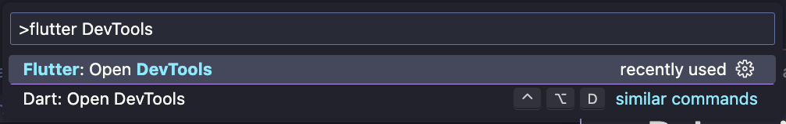

# Debugging Flutter apps

Debugging is the process of finding and fixing errors or issues in software. It involves identifying and resolving problems in a program's code that cause unexpected behavior, errors or crashes. Debugging is an essential part of the software development lifecycle, and it helps developers ensure that their code works correctly and as intended.

- [Debugging Flutter apps](#debugging-flutter-apps)
  - [Debug mode](#debug-mode)
  - [Flutter DevTools](#flutter-devtools)
    - [Opening the Flutter DevTools](#opening-the-flutter-devtools)
    - [DevTools key features](#devtools-key-features)
      - [Flutter inspector](#flutter-inspector)
      - [Timeline View](#timeline-view)
      - [Memory view](#memory-view)
      - [Performance overlay](#performance-overlay)
      - [Dart Devtools Integration](#dart-devtools-integration)
      - [Debugging and Hot Reload](#debugging-and-hot-reload)
      - [Command-Line Interface (CLI)](#command-line-interface-cli)

## Debug mode

Flutter much like most programming languages has a way of debugging code. To debug Flutter apps, first run the app with *Start Debugging*. Once the app builds and runs, you can manipulate the variables and execute breakpoints.

Breakpoints are a debugging feature used by developers to pause the execution of a program at a specific point in the code. By inserting breakpoints, developers can halt the program's execution temporarily to inspect the state of variables, analyze the flow of the code, and identify the root cause of the issues. Breakpoints are usually set inside the IDE.

## Flutter DevTools

The flutter DevTools are a suite of performance and debugging tools for Flutter developers. It provides a set of visual and command-line tools that help developers analyze, diagnose, and optimize their flutter applications. DevTools can be used during the development and debugging process to gain insights into the app's performance, identify potential issues, and streamline the development of workflow.

### Opening the Flutter DevTools

To use the Flutter DevTools run a project and click the rightmost button on the run bar in vscode:

    

The other option is to open the *Command palette* (on mac shift + command + p, on windows control + shift + p) and write Flutter DevTools to open them:

    

Press enter and open the DevTools on the Browser (it opens on Google Chrome by default).

### DevTools key features

Some of it's key features and components are the following:

#### Flutter inspector

The flutter inspector is a visual tool that allows developers to inspect the widget tree, explore widget properties, and see how widgets are rendered on the screen. It helps in understanding the widget hierarchy and diagnosing UI-related issues.

#### Timeline View

The timeline view provides a timeline of events that occur during the execution of a Flutter app. Developers can use this tool to analyze how the app utilizes resources over time.

#### Memory view

The Memory view in DevTools allows developers to analyze the memory usage of their flutter app. It provides insights into memory allocations, helps identify memory leaks, and offers tools for optimizing memory usage.

#### Performance overlay

DevTools includes a performance overlay that can be overlaid on the app during development. This overlay displays information such as frames per second (FPS) and helps developers identify performance issues in real-time.

#### Dart Devtools Integration

Dart DevTools is integrated into the Flutter DevTools suite. Dart DevTools provides additional tools for debugging Dart code, include source-level debugging, variable inspection, and breakpoints.

#### Debugging and Hot Reload

DevTools integrates with Flutter's debugging and hor reload capabilities. Developers can set breakpoints, step through code, and use hot reload to quickly apply code changes without restarting the entire application.

#### Command-Line Interface (CLI)

DevTools provides a command-line interface for users who prefer using the terminal. The CLI allows developers to start DevTools, configure it, and interact with it using text-based commands.
