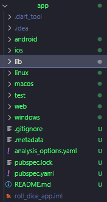

# Creating a flutter project

To create a flutter app, we first need to create a flutter project. A flutter project is where the app is designed. We design it using code, more specifically *Dart*. *Dart* is a object oriented programming language developed by google, it was developed for designing web and mobile apps.

## Creating the project

To start the process of creating a project, we first create a folder in a place of our choice within the computer.

    

Once that is done, open the terminal and navigate to the created folder. Then run the following command:

~~~shell
.\flutter> flutter create {project name}
~~~

## Analyzing a new flutter project

    

After running the code found abore, we can open the project we created. When a project is created, some files and folders are automatically created within it. One of the most important folders in the bunch is the ***lib*** folder. This folder is where we find all of the *.dart* files. Like aforementioned, dart is the language which we use to program flutter apps.

Although the lib folder is one of the most important in the project, it is not the only one. The platform named folders, such as *android*, *macos*, *linux*, *ios*, and *web*, contain platform specific files. Usually it is not necessary to use any of the mentioned folders, given that flutter changes and configures the files contained in the folders automatically when needed. These folders become very important when it comes to publishing an app to any specific platform.

The ***build*** folder is another important folder in which we don't do much. It contains input and output files generated by flutter as it builds the app for different target platforms. It is also managed automatically by flutter.

The ***test*** folder is another with *.dart* files. It is not where the main application code will be written, instead, this folder is one that can be used to test (duh) the main application code. Automated tests can be defined in order to find errors in the code early on, and to avoid manually testing code.

Some of the folders that start with '.' are configuration folders, such as ***.idea***, that contains extra configuration for android studio, or ***.dart_tool***, that contains some extra configuration for dart tooling (duh).

The other files with no folder, are more configurations for flutter and the project. ***.gitignore*** is a file used by git, it pretty much says to git what to ignore from the project (what not to be put online when publishing a project onto github). ***.metadata*** is a file managed automatically by flutter, it keeps track of some internal information and metadata about the project. ***analysis_options.yaml*** configures flutter and dart tooling to show errors and warnings in the app even before running the app. ***{app name}.iml*** another file managed by flutter, contains metadata and information necessary for running the app. ***pubspec.lock*** and ***pubspec.yaml*** are connected files the first is automatically managed by flutter, and the second is where third party packages can be added onto the project.

## Running a project

To run a flutter project, start the device in the virtual device manager, then we use the terminal and type:

~~~shell
.\flutter> flutter run
~~~

This will compile the code and run it in the emulator.