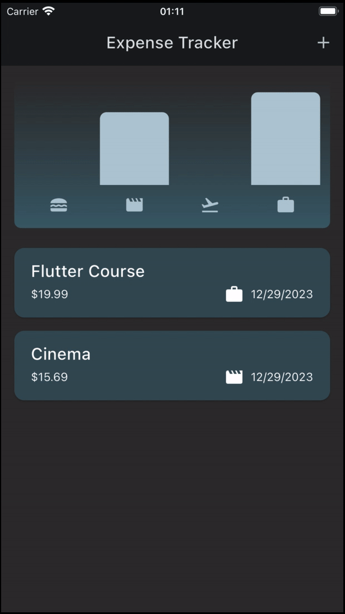
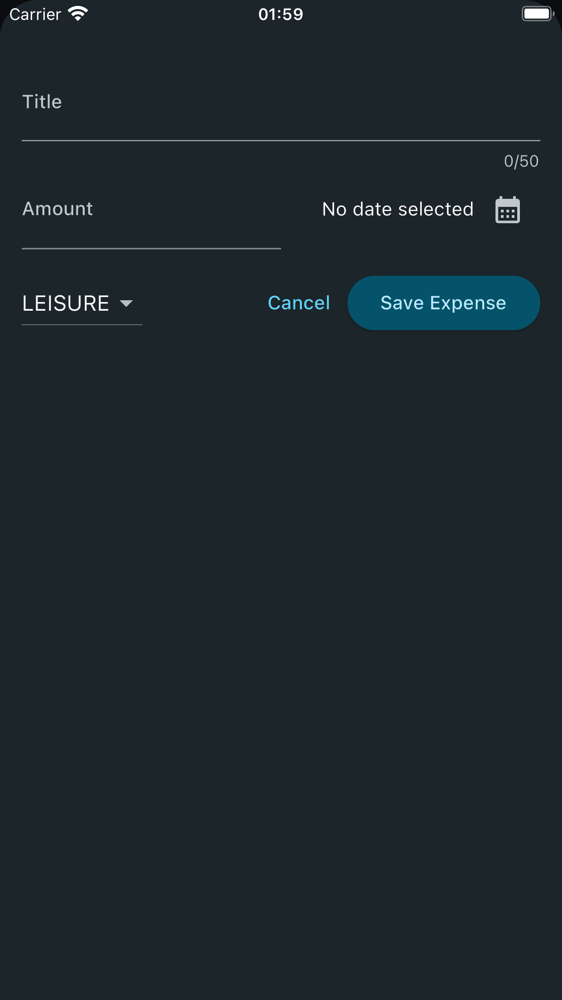
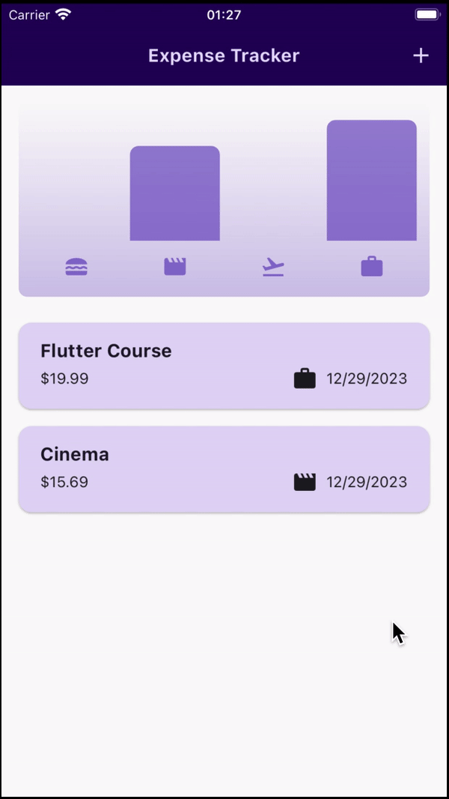

# Expense Tracker App

Flutter app that provides a simple way to track expenses between categories.

    

## Development

This app was developed to learn the uses of theming, managing and understand user interactivity.

### User interactivity

This app features a way that enables the user to create expenses. To do so, a form pops up, where the user adds the input.

    

### Theming

Unlike the two previous apps ([Quiz App](../quiz_app/) and [Roll Dice App](../roll_dice_app/)), this app features centralized theming. The whole app's theming is done within the ***MaterialApp*** widget.

#### Dark mode

While on theming, this app features a different light and dark theme. The active theme is determined by the device's default mode (either light or dark mode).

    

## Running the app

To run this app, follow the instructions [in this file](../TEXT_FILES/INTRODUCTION/flutter_setup.md)
