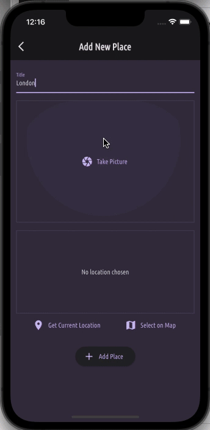
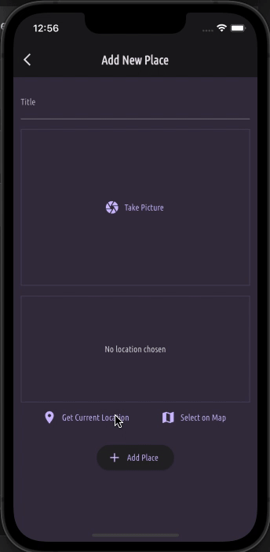

# Favorite Places App

Flutter app that allow the users to add favorite places with images and location.

    

## Development

This app was developed to learn how to implement features that use a device's native features, such as camera and location, and to store data within the device's memory.

### Using camera

This app uses the `image_picker` package in order to have access to the device's camera and library.

    

### Device's location

By using the `location` package and the `Google Maps Platform`, this app displays the user's current location, also allowing the user to select a location on a map.

    
    

### Storing data

This app saves the locations in the device's memory.

## Running the app

To run this app, follow the instructions [in this file](../TEXT_FILES/INTRODUCTION/flutter_setup.md)
