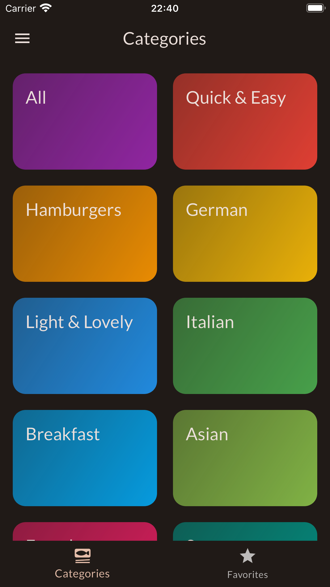
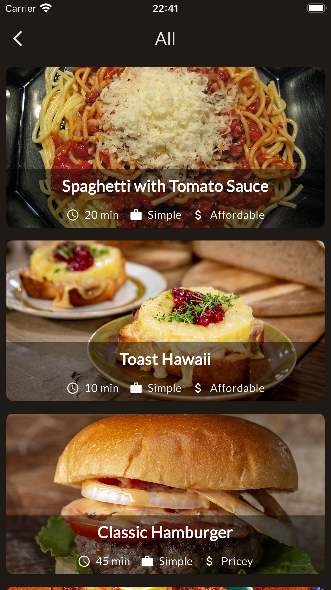
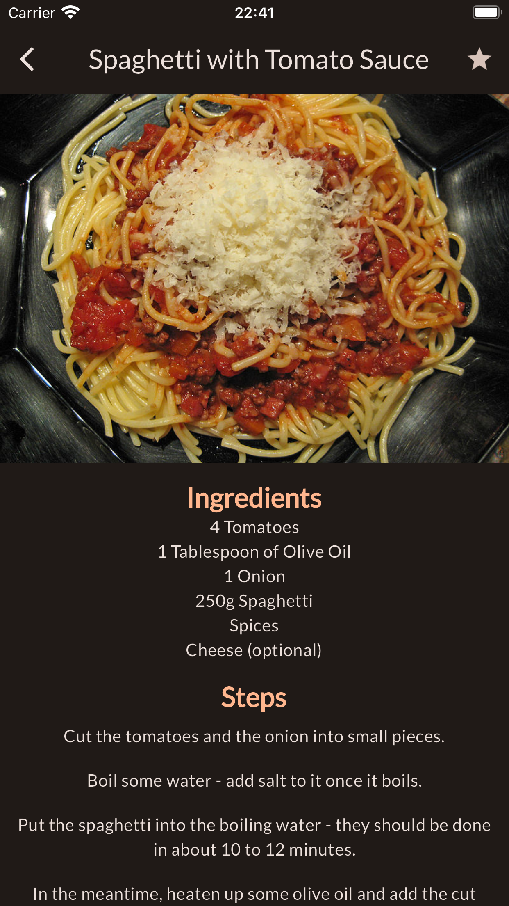
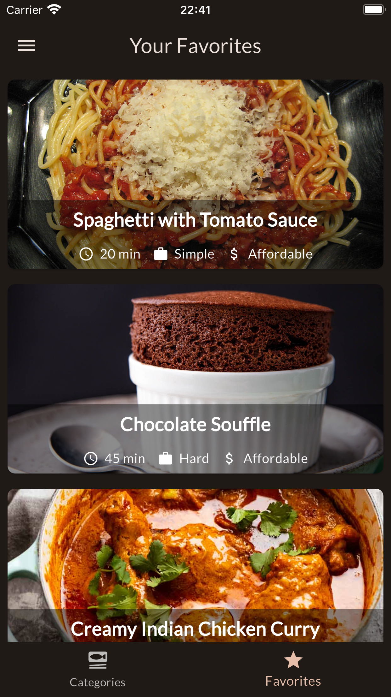
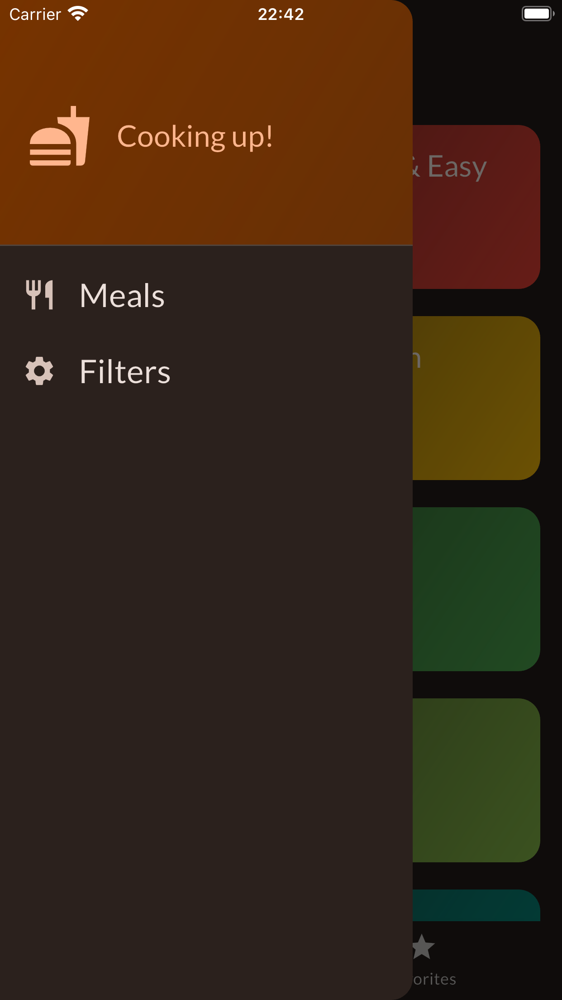
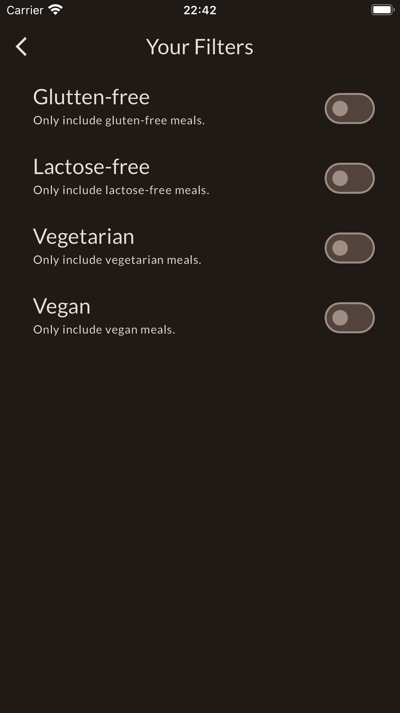

# Meals app

Flutter app that provides users a simple way of using, filtering and selecting favorite meals.

    

## Development

This app was developed to understand a few key concepts in app-building with Flutter. Concepts such as multi-screen apps and navigation, managing app-wide state, and using animations.

### Multi-screen apps

This app features 6 screens, a categories screen, meals screen, meal details screen, favorites screen, main drawer and a filters screen. To navigate between these screens, this app uses the Navigator class, stacking and unstacking screens to manage them.

    
    
    

    
    
    

### Managing App-Wide state

To manage state, this app uses the Riverpod package. This package allows the implementation of providers, a tool that is outside files and can be used app-wide easily.

### Animations

Finally, this app contains some simple animations using animation controllers and hero widgets. To animate a slight slide of the categories screen when initialized, and a transition when entering a meal's details.

## Running the app

To run this app, follow the instructions [in this file](../TEXT_FILES/INTRODUCTION/flutter_setup.md)
