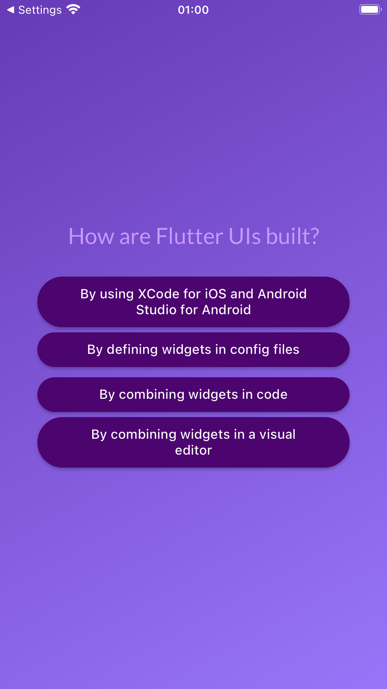
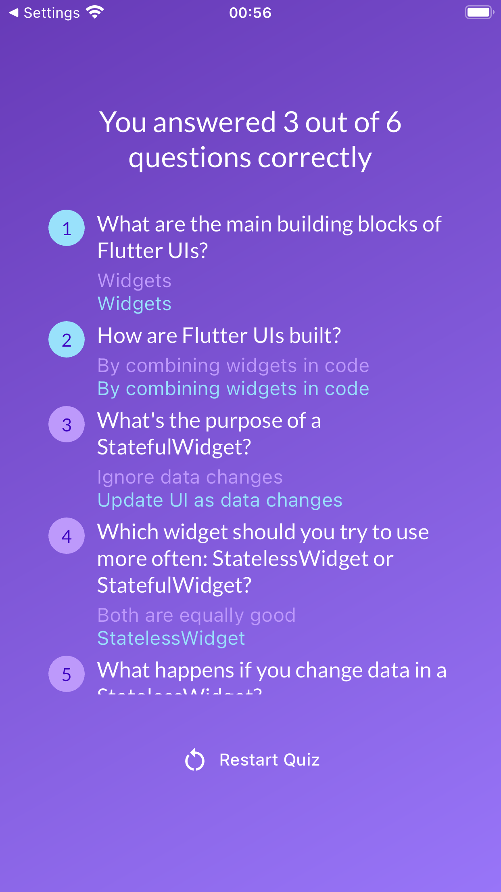

# Quiz App

Flutter app that provides a quiz about flutter features.

    

## Development

This app was developed for understanding some advanced dart and Flutter basics.

### Multiple screens

For this app, there are tree main screens. The first is the start screen, featuring a Flutter logo image and a button to start the quiz. The second one contains the quiz questions. And finally, the third one contains the results of the quiz. During this app's development, one of the main objectives was to learn one way of managing screens.

In this case, the navigation from the first screen to the second happens when the button is pressed, from the second to the third when the number of questions is reached, and from the third back to the first , again, when the button is pressed.

The start screen, questions screen and results screen respectively:

  
  
  

### Conditional Statements

Conditional statements are a core feature in programming. This app contains some implementation of conditional statements to manage internal features, namely to switch from the first to the second screens, and to show different colors if the question is answered correctly and incorrectly.

### Maps

Maps are a really useful functionality of dart. In this app, maps are used to differentiate the correctly answered questions from the incorrect ones by a color change. This is done by changing the color if the users answer matches with the correct one.

    

## Running the app

To run this app, follow the instructions [in this file](../TEXT_FILES/INTRODUCTION/flutter_setup.md)
