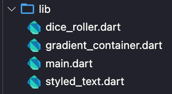
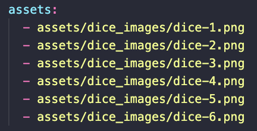

# Roll Dice App

Flutter app that rolls a six-sided die.

## Development

This app was developed to learn some of the most basic features of building a dart app.

Some of the most important concepts that have been used for the development of this app are as follow:

### File managing

For this project, some specific parts of the widget tree are separated in multiple files. This has been done to make it easier to read and understand individual files.

    

### Using assets

One simple thing that is covered in this app is the usage of assets. Whenever the ***"Roll Dice"*** button is pressed, an image is selected randomly from the assets folder.

For flutter to manage this folder, all assets contained in it need to be declared in the [pubspec.yaml](pubspec.yaml) file like so.

    

### Managing StatefulWidgets

One of the key concepts in dart is the usage of StatefulWidgets. In this app, specifically for the [dice roller](lib/dice_roller.dart) the state has to be managed so that the image can change once the button is pressed.

### Random package

To accurately represent a rolling dice, there is need for the number shown to be somewhat random. For this, the random package is used in this project.

Through the use of a so called "randomizer", a random number between 1 and 6 is generated, allowing the image to change accordingly.

## Running the app

To run this app, follow the instructions [in this file](../TEXT_FILES/INTRODUCTION/flutter_setup.md)
