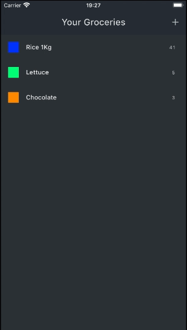
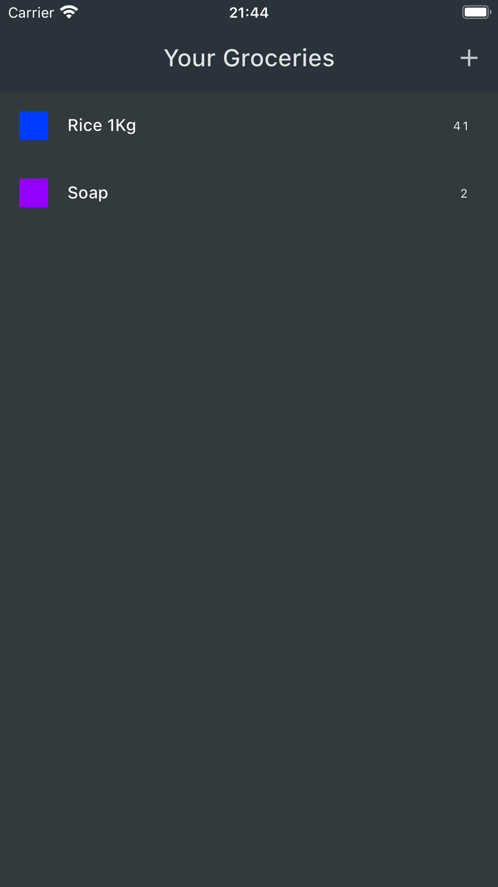
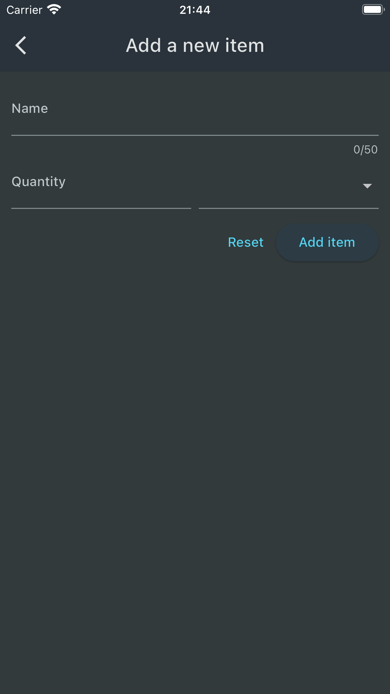
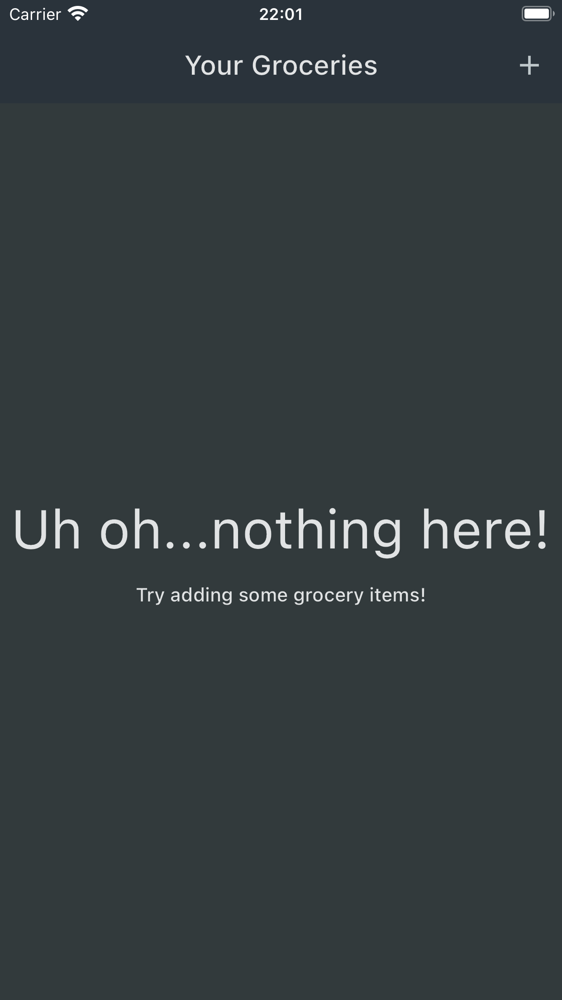
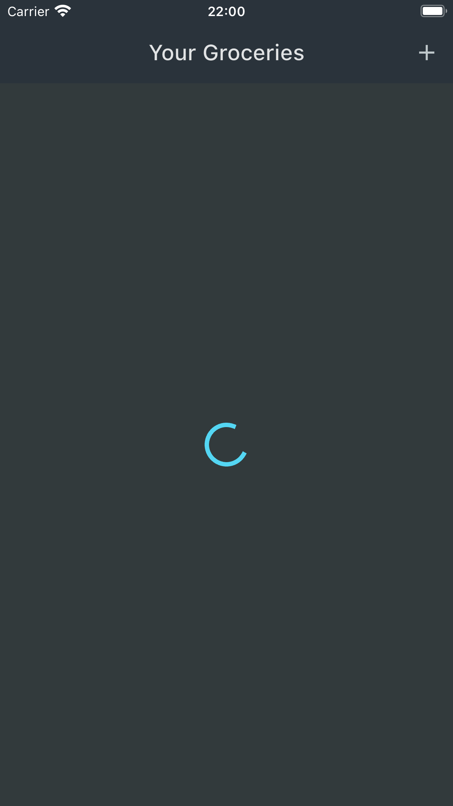
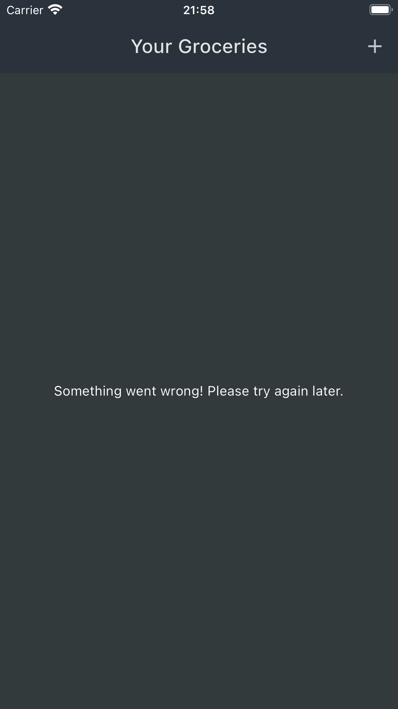

# Shopping List app

An app for the user to use as a Shopping list, by adding meals based on the name of the meal, category and quantity.

    

## Development

This app was developed to understand concepts of handling user input, connecting the app to a backend and handling errors that may be generated as a result.

    

### Handling user input

To add a new meal, this app uses the *Form Widget*. This widget offers versatility and makes it easier to validate and modify the user's input.

    

### Backend and handling errors

This app is a simple introduction to using a third-party service to store data generated in the app, in this case the chosen backend is *Firebase*. To properly use any type of backend, it's important to handle cases where something goes wrong. This is done by using circular progress indicators, showing error messages and so on.

    
    
    

## Running the app

To run this app, follow the instructions [in this file](../TEXT_FILES/INTRODUCTION/flutter_setup.md)
